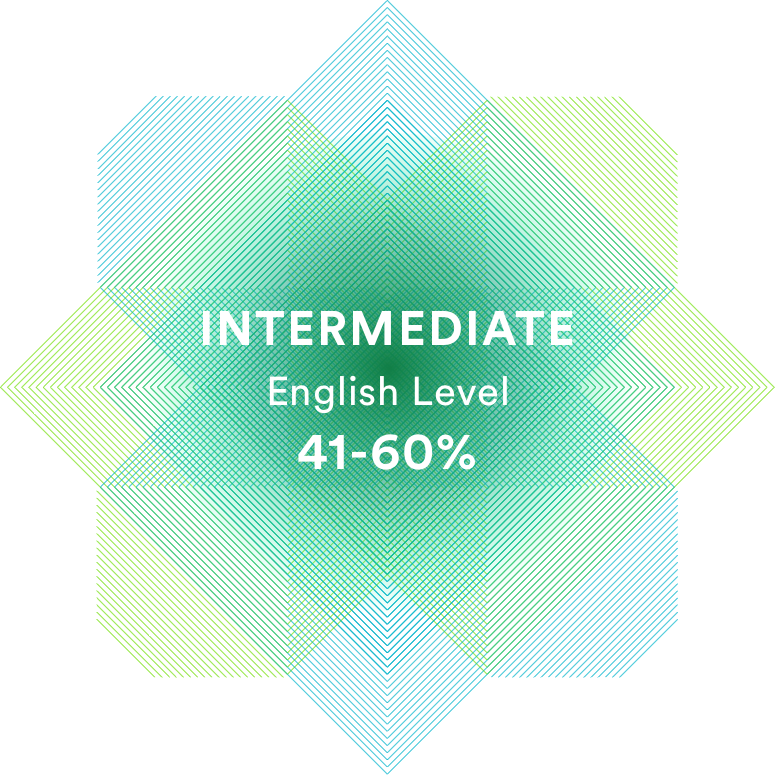

>**person:** **_Sergey Tomonov_**
>
> **contacts:** [Gmail](Nibler483@gmail.com) , [Skype](https://join.skype.com/invite/ht5RYLeIdtbi), [VK](https://vk.com/fisher_airsoft).
> 
>**telephone number:** 80257113386
>
>**about me:** _single-minded, capable of learning,disciplined.Currently studying front-end coding skills in **Rolling Scopes school**. 
>I am confident that my ideas will be realized as my experience enriches._
>
>**skills:** _Makdown preview Enhanced._
>
>**Education:** _higher education - **Belarusian State Aviation Academy** - Aircraft and Engine Operations Engineer._
>
>**knowledge of English:** _according to_ [EFset](https://www.efset.org/ru/) _my level of English is assessed as somewhere between B1 Intermediate and B2 Upper Intermediate according to the Common European Framework of Reference, also known as the CEFR._  

